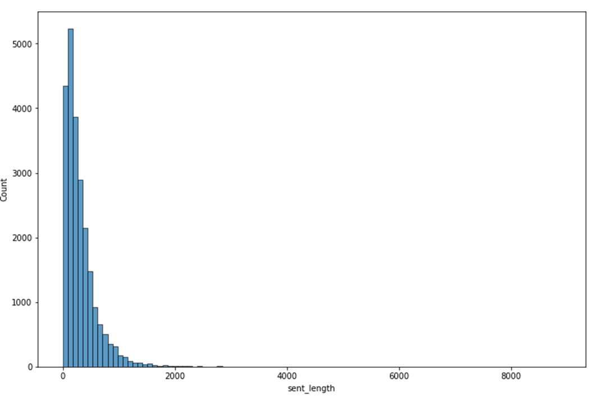

# Phase 4: Classification of sentences from Acts
To identify and predict the Jim crow sentences was a Machine Learning (ML) – multiclass/multilevel classification problem because we had to clasify the data into 3 labels, 0, 1, and 2. 

**Objective** To classify the “Jim crow” sentences in the South Carolina Acts as 0, 1, 2 where:
- "0" implied _not jim crow sentence
- "1" implied _jim crow sentence_
- "2" implied _undecided_

**Input** 
- SC Acts split into sentences in a csv file with year, sentence, and labels  (annotated by legal scholars and constituition experts).Law scholars helped assemble labeled data for creating the model. (Figure 1)
- The labeled data for creating a ML model was combined from the following resources: USC Civic Center's research, UNC labeled data, and SC legal experts using Pauli Murray book.

    
   Figure 1: Snapshot of labeled data for creating machine learning model 

**Preprocessing of the data before creating the model**
- Renamed "Label" column to "jim_crow" (1892_labeled_sentences.csv)
- Added 11 updated files with correct splitting: 1868_24-25_updated, 1868_143-145_updated, 1868_146-151_updated, 1877_571-586_updated.csv, 1884_24-26_updated.csv, 1886-87_1031-1034_updated.csv, 1886-87_1072-1074_updated.csv, 1868_24-25_updated, 1896_63act_updated, 1907_518-522_updated, 1925_324act_updated.
- Renamed the above files to make the naming consistent (- replaced by _, added 'labeled_sentences').
- Added column state = 'South Carolina' in all Civic Center coded files.
- Replaced the 'year' values in file 1886_87_1031-1034.csv from '1886-87' to 1886 and '1868_146-151_updated.csv' from '1868-69' to 1868.
    - Total **23,479 sentences** in the labeled data (Figure 2); 14913 sentences from North Carolina and 8566 sentences from South Carolina.
- As a preprocessing step, all the sentences with less than 27 characters were _discarded_ from model creation. (The number 27 is found after multiple attempts were carried out to check that NO sentence with label 1 is discarded).
    - Total **23,041 sentences** remained; Number of sentences that are NOT jim crow("0") = 18,056, Number of jim crow sentences("1") = 4,318, Number of undecided sentences("2") = 667 (Figure 3)

      
       
      Figure 2: Histogram of the sentence length in the labeled data.  
      Figure 3: Number of sentences with label "0", "1", and "2"  

Method: 

In the classification phase, supervised learning methods were explored (SGD, XGBoost, Naïve Bayes, and histGradient Boosting) and found that XGBoost was giving the best performance to identify Jim Crow laws within the corpus. 

Unlike the outputs of the sentence cleaning phase, the classification models only utilized two types of features to output the Jim Crow target label;  “categorical” features for the year and sentence. 

The target was a 3-class output of either a 0, 1, or 2 which represented not Jim Crow, Jim Crow, and maybe Jim Crow respectively. 

