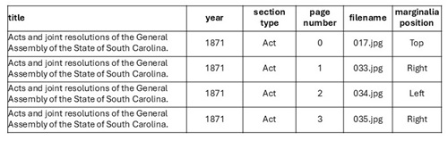

# Phase 1: Data Collection to create corpus

The corpus was created from the scanned SC constituition books available on [HathiTrust Digital Library](https://www.hathitrust.org/) and [HeinOnline](https://heinonline.org/HOL/Welcome). Seventy digitized volumes of the Acts and Joint Resolutions of the General Assembly of the State of South Carolina from 1866 – 1958 were downloaded from HathiTrust Digital Library as JPEGs and OCR’ed text. The remaining volumes were purchased as PDFs and OCR’ed text from HeinOnline.  

The South Carolina laws are divided up into *Acts or General laws* and *Joint Resolutions* also referred to as *Temporary Laws*. Based on the feedback from the legal scholars, the team decided to create corpus of **Acts** and not the Joint Resolutions in the volumes for analysis. 

**The final corpus consisted of SC Acts from 100 volumes starting from 1868 to 1968.**
The corpus consisted of images as jpeg's and tiff's as below:

  
  

# Metadata generation for the corpus
After the data is collected, the team created *page-level metadata* for each volume in an Excel spreadsheet. This metadata stated the: 
- title of the volume
- year
- file type (jpg or tiff)
- section type (Acts or Joint Resolutions)
- page number (starting from 0)
- file name (e.g. "image_name.jpg")
- marginalia position (top, left, or right)

While reviewing the pages, blank and other unwanted pages were excluded for metadata creation. The sample of metadata file is given below:
  
