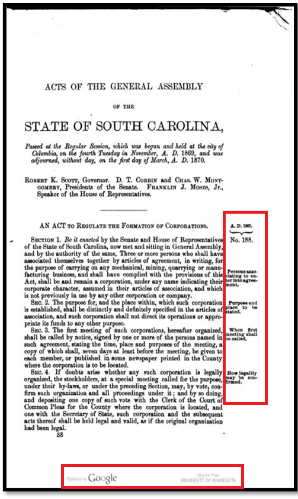
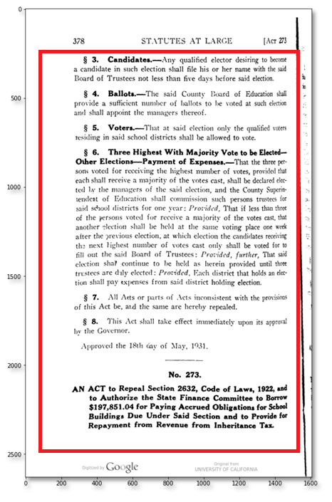
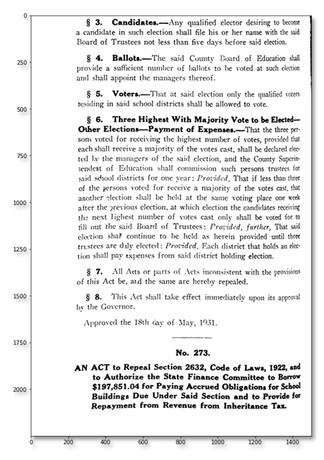

# Phase 2: Marginalia Removal and OCR
*Marginalia* is the text that was written in the borders of the pages to highlight or summarize the paragraph content. It was printed in the corpus volumes up through 1912. The marginalia are not part of the *Acts* and not needed for the machine learning and analysis, nor the paratextual information from page headers and footers. So, the marginalia and paratextual information had to be removed before OCRing the corpus. The marginalia removal process involved three steps:
- Determine the coordinates of the main text body and save them in a *csv* file. 
- Identify the median page color to allow for the creation of a blank, color-neutral border around the main body text on each page (bounding box).
- Crop the marginalia using the bounding box coordinates.

 Below Figure 1 is the page with marginalia; Figure 2 and Figure 3 are determination of bounding box coordinates and cropped image respectively.

      
      &nbsp;&nbsp;&nbsp;&nbsp;&nbsp;&nbsp;&nbsp;&nbsp;
       
      &nbsp;&nbsp;&nbsp;&nbsp;&nbsp;&nbsp;&nbsp;&nbsp;
        
      Figure 1: Example of marginalia on a page image.  
      &nbsp;&nbsp;&nbsp;&nbsp;&nbsp;&nbsp;&nbsp;&nbsp;&nbsp;&nbsp;&nbsp;&nbsp;&nbsp;&nbsp;&nbsp;&nbsp;&nbsp;&nbsp;&nbsp;
      &nbsp;&nbsp;&nbsp;&nbsp;&nbsp;&nbsp;&nbsp;
      Figure 2: Finding bounding box coordinates.  
      &nbsp;&nbsp;&nbsp;&nbsp;&nbsp;&nbsp;&nbsp;&nbsp;&nbsp;&nbsp;&nbsp;&nbsp;&nbsp;&nbsp;&nbsp;&nbsp;&nbsp;&nbsp;&nbsp;
      &nbsp;&nbsp;&nbsp;&nbsp;&nbsp;&nbsp;&nbsp;
      Figure 3: Page with cropped marginalia  
   

The volumes before 1934 had marginalia. The [crop_functions_updated_.ipynb](crop_functions_updated_.py) and [test_functs.ipynb](test_functs.ipynb) files were originally from UNC, however they were limited in that it didn’t crop the entire volume. So, they were modified to read all files, either .tiff or .jpg, from the given directory for one volume. All the files in that volume are read in one go. 

The volumes from 1934 to 1968 did not have any marginalia. So, we used the [test_functs_SimpleWay_NoMarginalia.ipynb](test_functs_SimpleWay_NoMarginalia.ipynb) to find the bounding box coordinates using brute-force approach. This method worked very well with >90% success rate. For few pages which were not cropped correctly with this approach, the bounding box coordinates were adjusted manually. The same method [test_functs_SimpleWay_With_Marginalia.ipynb](test_functs_SimpleWay_With_Marginalia.ipynb) was used for some other images also which were giving errors for the `crop_functions_updated_.py.`

**Things to remember**
- The `crop_functions_updated_.ipynb` was modified to handle its exit whenever a file threw any kind of error, such as a failure to crop the file. The files which threw errors were stored in a separate csv file, called `errors_year.csv` where year was the year of the volume. The crop coordinates for other files, which were cropped by the code, were stored in another csv file, `year.csv`.
- Some pages were not cropped properly but also didn't throw errors. Those pages were not stored in the `errors_year.csv` file, but in the `year.csv` file. The only way to detect them was to manually go through the cell output, which contains a side-by-side view of the original images and their cropped versions, produced by running `test_functs.ipynb` and keeping track of the incorrectly cropped files.
- User should run `test_functs.ipynb` which called `crop_functions_updated_.py`. However, if the majority of images are not being cropped properly, then it is advised to play with the values of dil_iter, x_buffer, and y_buffer in`crop_functions_updated_.py`.

### OCRing the volumes
[***Tesseract***](https://github.com/tesseract-ocr/tesseract) was used to OCR the volumes. The jupyter notebook configurations for OCRing were pulled down from UNC’s On The Books Github page. The required `adjustments.csv`,  `marginalia_metadata.csv` (bounding box coordinates file), and `xmljpegmerge.csv` files are created from metadata supplied by the team. In the `ocr_func.py` file psm in the OCRtestImg function was changed to 11 to better accommodate tabular data in the ocr process. Output is downloaded and paired with the corpus files. For example, the OCR input files for year 1920 were [1920_adjustments.csv](1920_adjustments.txt), [1920_marginalia_metadata.csv](1920_marginalia_metadata.csv), and [1920_xmljpegmerge.csv](1920_xmljpegmerge.csv). Along with other files, the [1920_Acts.txt](1920_Acts.txt) was generated as output which we used for machine learning task.
