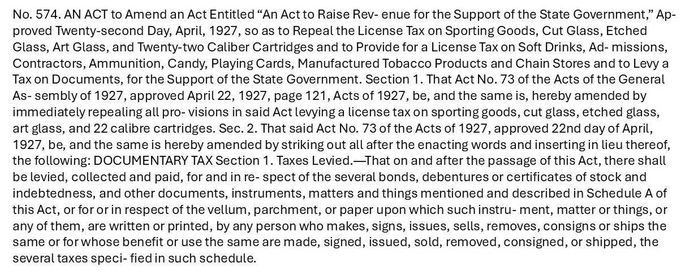

# Phase 3: Sentence Splitting and Cleaning

Following the OCR process, the `year_Acts.txt` file of each volume was split into its constituent sentences where each sentence represented an act. The splitting was followed by a cleaning process that attempted to clean up errors introduced from the marginalia removal or OCR processes. The split and cleanings used NLTK’s `PunktSentenceTokenizer`, some simple spellchecking, and regular expressions.

A sample OCRed file for year `1928` is given below (Figure 1):

 
 &nbsp;&nbsp;&nbsp;&nbsp;&nbsp;&nbsp;&nbsp; &nbsp;&nbsp;&nbsp;&nbsp;&nbsp;&nbsp;&nbsp;
Figure 1: Snapshot of OCRed volume of 1928  
    
The metadata accompanying each act was:
1. An id consisting of the act’s year and a unique act number
2. The law type, for example, Acts
3. The State, for example, South Carolina
4. The sentence
5. The length of the characters in the act
6. The starting page's file name
7. The ending page's file name
8. The act label
9. The section label
10. The path to the image

Note
- Despite the cleaning process, many errors existed in the final csv files, mostly due to the nature of regex matching, OCR, marginalia removals, and image scans.
- In addition, some Joint Resolutions were also mixed with Acts in the OCR files. Those sentence were also detected and labeled.
- As mentioned in [sentence_splitting.ipynb](sentence_splitting.ipynb), that volumes before, and including, 1894 have Act labels in their marginalias. During the marginlia removal process, these Act labels are removed. To assign each sentence an Act label, the code beklow utilizes `regex` patterns finding Act labels in the text. Thus, for volumes with Act labels in their marginalias, *the Act labels are highly inaccurate.*
- `Act` or `Section` labels for other volumes may also be inaccurate due to the nature of errors arising from marginalia removals, OCR, and non-perfect regex matches.
- At the end, sentences from all volumes were aggregated into a single csv file and a seperate csv file was also generated for each year.

    
      Figure 1: Example of marginalia on a page image.  
      &nbsp;&nbsp;&nbsp;&nbsp;&nbsp;&nbsp;&nbsp;&nbsp;&nbsp;&nbsp;&nbsp;&nbsp;&nbsp;&nbsp;&nbsp;&nbsp;&nbsp;&nbsp;&nbsp;
      &nbsp;&nbsp;&nbsp;&nbsp;&nbsp;&nbsp;&nbsp;
      
